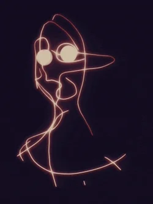

# PostRec version 1.0.0
### _powered by Festus_

---


Desktop posture-monitoring prototype that uses only OpenCV for real-time posture estimation.
No datasets or external ML models — purely geometric/contour heuristics.

You also get a dataset from the process which can be used later for more improvemenys if needed

## test 1 image


## Features
- PyQt6 GUI with live camera feed
- OpenCV contour-based posture heuristics (spine angle, shoulder tilt, head offset)
- Real-time overlay and status indicator (Optimal / Adjust / Critical)
- Session recording and CSV export

## test 2 image


## Requirements
```bash
pip install -r requirements.txt
```

## Run
```bash
python main.py
```
## test 3 image

## Notes
- Works best with plain backgrounds and decent lighting.
- This is a heuristic-based prototype for demonstration and should not be used as a medical device.
